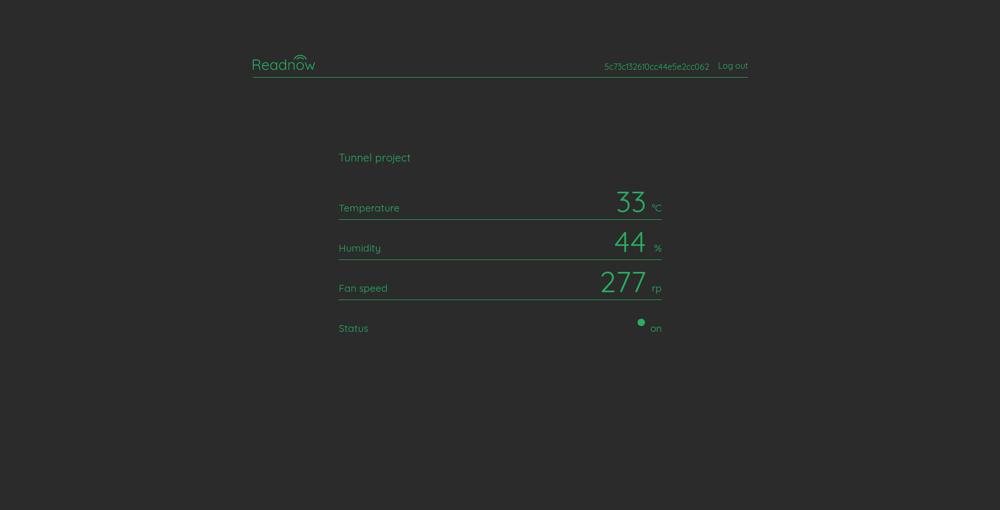
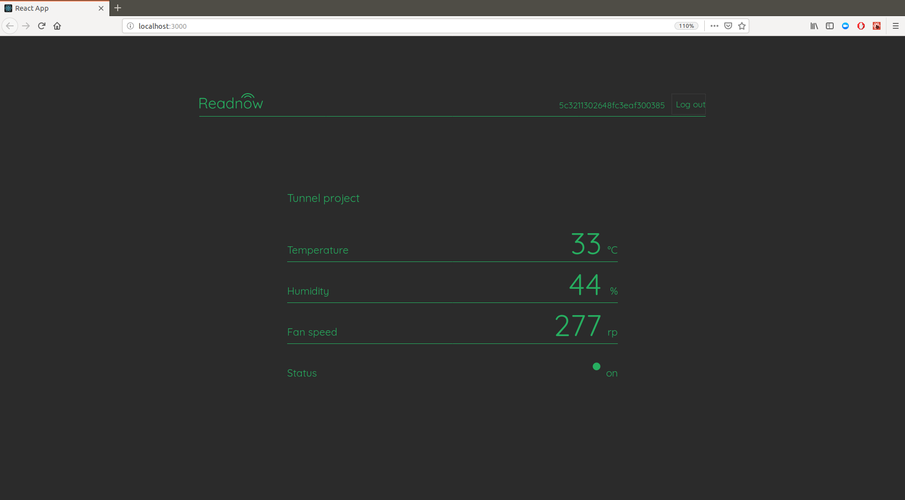

# Readnow-1.0
Probably the easyest way to go online with your IoT

On Readnow you would be able to create your individual page, where you can send and display data easily. This can be done with HTTP requests, both with POST(recomended) but also with GET for quick test (if that is the only way).

live demo:
https://github.com/nikoada/Readnow-1.0

How to use:

Enter Title of your project. Add one or more parameters (like Temperature, humidity etc. you want to monitor) and extensions like °C, % etc. Click submit button.

You now created your project node. Your node was assigned a password wich you see on top right corner. Later you can use that password to log in into your node page, so copy and save it now please.
That’s it, no need to register.

Now when everything is seted up, you can test and send values to your node like so:
http://readnow.vulkanclub.tech/postValue?id=YOUR_PASSWORD&value1=YOUR_FIRST_VALUE&value2=YOUR_SECOND_VALUE&value3=YOUR_THIRD_VALUE

for previouse example it would look like:
http://readnow.vulkanclub.tech/postValue?id=5c73c132610cc44e5e2cc062&value1=33&value2=44&value3=277

Proper way to update a value would be to make a PUT requiest on http://readnow.vulkanclub.tech/postValue and send JSON like so:
{
    "id": "5c73c132610cc44e5e2cc062",
    "data": {
        "value1": 33,
        "value2": 44,
        "value3": 277
    }
}
