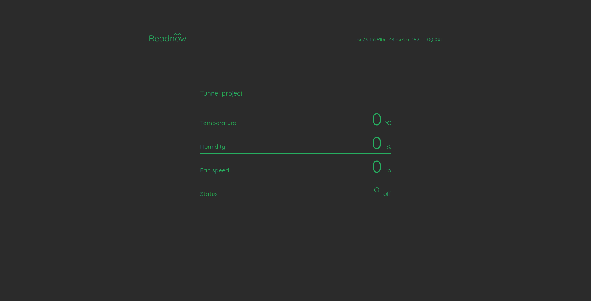

# Readnow-1.0
Easyest way to go online with IoT

On Readnow you would be able to create your individual page, where you can send and display data easily. This can be done with HTTP requests, both with POST(recomended) but also with GET(if that is the only way).

No need to register.
Easy to use interface.
Will be online in March 2019.

