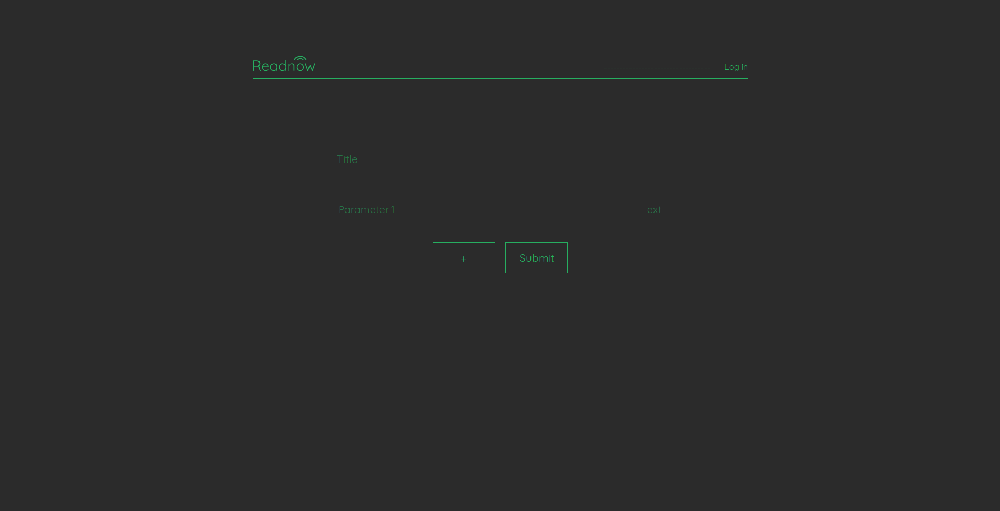

# Readnow-1.0
Easyest way to go online with IoT

any microcontroller or some other devices can send the data, values, measurements of sensors ect. to Readnow via http requests, both POST(recomended) but also with GET.
No need of registration.
Easy to use, user-friendly interface.
Will be online in March 2019.

